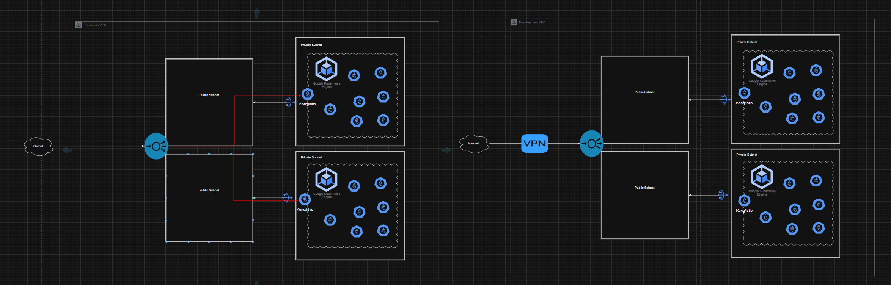

# Arquitetura e Estrutura do Repositório

Este repositório contém a infraestrutura e configurações de deploy baseadas na arquitetura definida no diagrama de referência. Abaixo estão os principais conceitos e decisões de design implementados.

## Estrutura de Rede

A infraestrutura de rede foi desenhada para garantir segurança, alta disponibilidade e isolamento entre ambientes. 

- **Isolamento de Ambientes:** Cada ambiente (Production e Development) roda separadamente em sua própria VPC/Conta, garantindo total isolamento do ambiente produtivo.
- **Topologia de Subnets:** 
  - Uma VPC distribuída entre várias subnets, com workloads espalhados por várias zonas de disponibilidade.
  - Para fins de ilustração, utilizamos 2 subnets privadas e 2 públicas, mas este número é sempre dimensionado de acordo com o tamanho e a necessidade do projeto.
- **Conectividade Externa (Load Balancer e NAT):** Um LoadBalancer é provisionado nas subnets públicas, redirecionando o tráfego e se comunicando com as redes privadas através de NAT Gateways.
- **Workloads Privados:** O cluster Google Kubernetes Engine (GKE) e todos os Worker Nodes são provisionados estritamente nas subnets privadas por segurança.
- **Regras de Acesso:** A entrada e a saída de dados são configuradas de forma rigorosa via regras de firewall.
- **Ambiente de Desenvolvimento (VPN):** A Development VPC é exposta apenas através de uma VPN, com acesso altamente restrito.

## Estrutura de GitOps

A gestão do ciclo de vida das aplicações no Kubernetes é feita seguindo os princípios de GitOps:

- **Ferramentas de Sincronização:** Utiliza-se **ArgoCD** (ou FluxCD) provisionado no próprio cluster para garantir que o estado do cluster reflita exatamente as definições do Git.
- **Kustomize Overlays:** A organização dos manifestos utiliza a arquitetura de **overlays com Kustomize** (ex: pastas base, dev, prod), permitindo o reuso de configurações.
- **Processo de Deploy de Imagens:** 
  - A imagem da aplicação é compilada (build) na esteira de CI/CD.
  - Com a tag da release, a imagem é versionada no repositório de imagens (Container Registry).
  - A promoção da nova imagem no ambiente é feita atualizando o arquivo `kustomization.yaml` (usando comandos como `kustomize edit set image`), alterando a tag nos Helm charts ou deployments/rollouts.
- **Segurança e Scan:** O **Trivy** é utilizado na pipeline para fazer o scanner de vulnerabilidades nas imagens geradas antes de serem promovidas aos ambientes.

## Estratégia de IAM e Segurança

A gestão de identidades e acessos segue as melhores práticas de segurança de nuvem:

- **Princípio do Menor Privilégio:** Todas as contas de serviço (*Service Accounts*) e usuários possuem apenas as permissões estritamente necessárias para a execução de suas funções.
- **Workload Identity:** No GKE, os workloads e pods utilizam o Workload Identity para se autenticarem diretamente nas APIs do Google Cloud. Isso elimina a necessidade de gerenciar e rotacionar chaves (arquivos JSON) de Service Accounts estáticas, reduzindo muito os riscos de exposição.
- **RBAC no Kubernetes:** O *Role-Based Access Control* (RBAC) é aplicado ativamente para isolar as permissões dentro do cluster, garantindo que o controlador de GitOps (ex: ArgoCD) e os pipelines de integração possam interagir apenas com os recursos específicos dos seus namespaces autorizados.

## Gestão de Secrets

Para unir de forma fluida a metodologia GitOps (onde a fonte da verdade está no repositório) com a máxima segurança de dados confidenciais (senhas, tokens, chaves de API), adotamos as seguintes abordagens para o gerenciamento de *Secrets*:

- **Google Secret Manager + External Secrets Operator:** Como solução recomendada para produção, centralizamos o armazenamento seguro de credenciais na nuvem através do Google Secret Manager. No cluster, utilizamos o *External Secrets Operator*, que busca os segredos diretamente do cofre na nuvem de forma protegida e cria dinamicamente os *Secrets* nativos do Kubernetes.

## Diagramas e Referências Visuais

Abaixo estão as referências visuais da arquitetura de rede proposta e também do processo de checagem com a ferramenta Trivy:

### Arquitetura de Rede

### Scanner de Vulnerabilidades com Trivy
 
